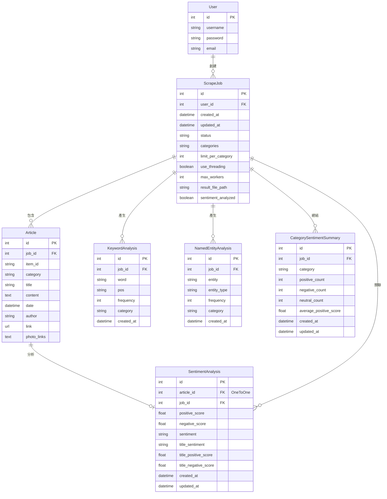

# 新聞爬蟲與全文檢索關聯分析系統

## 專案概述

本專案是一個基於Django的新聞爬蟲與分析系統，主要功能包括從中時電子報(China Times)抓取新聞文章，進行中文自然語言處理分析，並提供全文檢索、關鍵詞分析、命名實體識別、情感分析以及領導人物提及分析等功能。系統使用了現代化的前後端技術，實現了新聞資料的自動抓取、存儲、分析與可視化。

本項目代碼託管於 GitHub：[https://github.com/Terbinm/news_scraper_web](https://github.com/Terbinm/news_scraper_web)

### 主要特點

- **多類別新聞爬取**：支援財經、政治、社會等9個類別的新聞抓取
- **自然語言處理**：使用CKIP中文斷詞系統進行文本分析
- **全文檢索引擎**：支援複雜查詢條件與多維度分析
- **情感分析**：使用預訓練模型分析文章情感傾向
- **數據可視化**：使用Chart.js等工具直觀展示分析結果
- **領導人物分析**：針對特定領導人物進行關注度與情感傾向分析
- **多用戶支援**：基於Django認證系統，支援多用戶獨立資料管理

## 系統架構

### 技術棧

- **後端框架**：Django 4.2
- **前端技術**：Bootstrap 5、Chart.js、D3.js
- **資料庫**：SQLite（開發環境）/ PostgreSQL（生產環境）
- **爬蟲技術**：Selenium、undetected-chromedriver
- **NLP工具**：CKIP Transformers、HuggingFace Transformers
- **情感分析**：基於RoBERTa的預訓練模型

### 系統模組

```mermaid
flowchart TD
    %% User Interface Layer
    subgraph "User Interface"
        Browser["User Browser"]:::external
    end

    %% Web Application Layer
    subgraph "Web Layer"
        DjangoServer["Django Server (ASGI/WSGI)"]:::web
        URLRouter["URL Router"]:::web
        Views["Views (scraper/views.py)"]:::web
        Templates["Templates"]:::web
        StaticAssets["Static Assets (CSS/JS)"]:::web
        Browser -->|"HTTP Request"| DjangoServer
        DjangoServer -->|"routes to"| URLRouter
        URLRouter -->|"calls"| Views
        Views -->|"renders"| Templates
        Views -->|"serves"| StaticAssets
    end

    %% Service Layer
    subgraph "Services Layer"
        ScraperService["ScraperService"]:::service
        AnalysisService["AnalysisService"]:::service
        SentimentService["SentimentService"]:::service
        SearchService["SearchService"]:::service
        TaskService["TaskService"]:::service
    end

    %% Background Task Layer
    subgraph "Background Layer"
        CeleryWorker["Celery Worker"]:::background
        RedisBroker["Redis (Broker & Cache)"]:::data
        Views -->|"trigger task"| TaskService
        TaskService -->|"enqueue"| CeleryWorker
        CeleryWorker -->|"uses"| ScraperService
        CeleryWorker -->|"uses"| AnalysisService
        CeleryWorker -->|"uses"| SentimentService
        CeleryWorker -->|"uses"| SearchService
        CeleryWorker -->|"publishes"| RedisBroker
    end

    %% Data Layer
    subgraph "Data Layer"
        Database["Database (SQLite/PostgreSQL)"]:::data
        Media["Media Storage"]:::data
        Cache["Redis Cache"]:::data
        ScraperService -->|"writes Article, ScrapeJob"| Database
        AnalysisService -->|"writes Analysis tables"| Database
        SentimentService -->|"writes Sentiment tables"| Database
        SearchService -->|"queries"| Database
        SearchService -->|"reads/writes"| Cache
    end

    %% External Dependencies
    subgraph "External Services"
        ChinaTimes["China Times Website"]:::external
        CKIP["CKIP Transformers"]:::external
        HFModels["HuggingFace Models"]:::external
        ScraperService -->|"crawls"| ChinaTimes
        AnalysisService -->|"calls"| CKIP
        SentimentService -->|"loads"| HFModels
    end

    %% Search flow back to UI
    SearchService -->|"returns data"| Views
    Views -->|"JSON/HTML"| Browser

    %% Click Events
    click DjangoServer "https://github.com/terbinm/news_scraper_web/blob/master/news_scraper_web/asgi.py"
    click DjangoServer "https://github.com/terbinm/news_scraper_web/blob/master/news_scraper_web/wsgi.py"
    click URLRouter "https://github.com/terbinm/news_scraper_web/blob/master/news_scraper_web/urls.py"
    click Views "https://github.com/terbinm/news_scraper_web/blob/master/scraper/views.py"
    click Templates "https://github.com/terbinm/news_scraper_web/blob/master/templates/base.html"
    click Templates "https://github.com/terbinm/news_scraper_web/blob/master/templates/scraper/*.html"
    click StaticAssets "https://github.com/terbinm/news_scraper_web/blob/master/static/css/main.css"
    click StaticAssets "https://github.com/terbinm/news_scraper_web/blob/master/static/js/main.js"
    click ScraperService "https://github.com/terbinm/news_scraper_web/blob/master/scraper/services/scraper_service.py"
    click AnalysisService "https://github.com/terbinm/news_scraper_web/blob/master/scraper/services/analysis_service.py"
    click SentimentService "https://github.com/terbinm/news_scraper_web/blob/master/scraper/services/sentiment_service.py"
    click SearchService "https://github.com/terbinm/news_scraper_web/blob/master/scraper/services/search_service.py"
    click TaskService "https://github.com/terbinm/news_scraper_web/blob/master/scraper/services/task_service.py"
    click RedisBroker "https://github.com/terbinm/news_scraper_web/blob/master/requirements.txt"
    click Database "https://github.com/terbinm/news_scraper_web/blob/master/database-erd.mermaid"
    click Views "https://github.com/terbinm/news_scraper_web/blob/master/scraper/urls.py"
    click Views "https://github.com/terbinm/news_scraper_web/blob/master/scraper/forms.py"
    click Views "https://github.com/terbinm/news_scraper_web/blob/master/scraper/api.py"
    click Views "https://github.com/terbinm/news_scraper_web/blob/master/scraper/admin.py"
    click CeleryWorker "https://github.com/terbinm/news_scraper_web/blob/master/scraper/tasks.py"

    %% Styles
    classDef web fill:#b3d7ff,stroke:#036,stroke-width:1px
    classDef service fill:#c2f0c2,stroke:#070,stroke-width:1px
    classDef background fill:#ffd9b3,stroke:#f60,stroke-width:1px
    classDef data fill:#e0e0e0,stroke:#666,stroke-width:1px
    classDef external fill:#e6ccff,stroke:#704,stroke-width:1px
```



系統主要由以下模組組成：

1. **爬蟲模組**：負責自動抓取新聞文章
2. **分析模組**：提供文本處理與分析功能
3. **檢索模組**：實現全文檢索與複雜查詢
4. **情感分析模組**：分析文章情感傾向
5. **視覺化模組**：將分析結果轉換為圖表
6. **用戶管理模組**：處理用戶認證與權限


### 項目目錄結構

```
news_scraper_web/
├── manage.py                  # Django 管理腳本
├── news_scraper_web/          # 主項目目錄
│   ├── __init__.py
│   ├── asgi.py                # ASGI 配置
│   ├── settings.py            # 項目設置
│   ├── urls.py                # URL 配置
│   └── wsgi.py                # WSGI 配置
├── scraper/                   # 爬蟲應用
│   ├── __init__.py
│   ├── admin.py               # 管理界面配置
│   ├── api.py                 # API 接口
│   ├── apps.py                # 應用配置
│   ├── forms.py               # 表單定義
│   ├── migrations/            # 資料庫遷移文件
│   ├── models.py              # 資料庫模型
│   ├── services/              # 服務模塊
│   │   ├── __init__.py
│   │   ├── analysis_service.py # 分析服務
│   │   ├── scraper_service.py  # 爬蟲服務
│   │   ├── search_service.py   # 搜索服務
│   │   ├── sentiment_service.py # 情感分析服務
│   │   └── task_service.py     # 任務服務
│   ├── tasks.py               # 後台任務
│   ├── templatetags/          # 模板標籤
│   ├── tests.py               # 測試
│   ├── urls.py                # URL 配置
│   ├── utils/                 # 工具函數
│   │   ├── __init__.py
│   │   ├── chart_utils.py     # 圖表工具
│   │   ├── scraper_utils.py   # 爬蟲工具
│   │   └── sentiment_analyzer.py # 情感分析器
│   └── views.py               # 視圖函數
├── media/                     # 媒體文件
│   ├── charts/                # 圖表
│   ├── models/                # 模型文件
│   └── scraper_output/        # 爬蟲輸出
├── static/                    # 靜態文件
└── templates/                 # 模板文件
```

## 資料庫設計

系統使用關聯式資料庫，共包含以下主要資料表：

### 資料表結構

#### 1. ScrapeJob（爬蟲任務）

| 欄位名稱 | 資料類型 | 說明 |
|---------|---------|------|
| id | BigAutoField | 主鍵 |
| user | ForeignKey | 外鍵，關聯到Django用戶 |
| created_at | DateTimeField | 創建時間 |
| updated_at | DateTimeField | 更新時間 |
| status | CharField | 任務狀態（等待中、執行中、已完成、失敗） |
| categories | CharField | 爬取類別，以逗號分隔 |
| limit_per_category | IntegerField | 每個類別的文章數量限制 |
| use_threading | BooleanField | 是否使用多線程 |
| max_workers | IntegerField | 最大工作線程數 |
| result_file_path | CharField | 結果文件路徑 |
| sentiment_analyzed | BooleanField | 情感分析是否完成 |

#### 2. Article（文章）

| 欄位名稱 | 資料類型 | 說明 |
|---------|---------|------|
| id | BigAutoField | 主鍵 |
| job | ForeignKey | 外鍵，關聯到ScrapeJob |
| item_id | CharField | 文章唯一標識符 |
| category | CharField | 文章類別 |
| title | CharField | 標題 |
| content | TextField | 內容 |
| date | DateTimeField | 發布日期 |
| author | CharField | 作者 |
| link | URLField | 原始連結 |
| photo_links | TextField | 圖片連結（JSON格式） |

#### 3. KeywordAnalysis（關鍵詞分析）

| 欄位名稱 | 資料類型 | 說明 |
|---------|---------|------|
| id | BigAutoField | 主鍵 |
| job | ForeignKey | 外鍵，關聯到ScrapeJob |
| word | CharField | 關鍵詞 |
| pos | CharField | 詞性 |
| frequency | IntegerField | 頻率 |
| category | CharField | 類別 |
| created_at | DateTimeField | 創建時間 |

#### 4. NamedEntityAnalysis（命名實體分析）

| 欄位名稱 | 資料類型 | 說明 |
|---------|---------|------|
| id | BigAutoField | 主鍵 |
| job | ForeignKey | 外鍵，關聯到ScrapeJob |
| entity | CharField | 實體 |
| entity_type | CharField | 實體類型（人物、地點、組織等） |
| frequency | IntegerField | 頻率 |
| category | CharField | 類別 |
| created_at | DateTimeField | 創建時間 |

#### 5. SentimentAnalysis（情感分析）

| 欄位名稱 | 資料類型 | 說明 |
|---------|---------|------|
| id | BigAutoField | 主鍵 |
| article | OneToOneField | 外鍵，關聯到Article |
| job | ForeignKey | 外鍵，關聯到ScrapeJob |
| positive_score | FloatField | 正面情感分數 |
| negative_score | FloatField | 負面情感分數 |
| sentiment | CharField | 情感傾向（正面、負面、中立） |
| title_sentiment | CharField | 標題情感傾向 |
| title_positive_score | FloatField | 標題正面分數 |
| title_negative_score | FloatField | 標題負面分數 |
| created_at | DateTimeField | 創建時間 |
| updated_at | DateTimeField | 更新時間 |

#### 6. CategorySentimentSummary（類別情感摘要）

| 欄位名稱 | 資料類型 | 說明 |
|---------|---------|------|
| id | BigAutoField | 主鍵 |
| job | ForeignKey | 外鍵，關聯到ScrapeJob |
| category | CharField | 類別 |
| positive_count | IntegerField | 正面文章數 |
| negative_count | IntegerField | 負面文章數 |
| neutral_count | IntegerField | 中立文章數 |
| average_positive_score | FloatField | 平均正面分數 |
| created_at | DateTimeField | 創建時間 |
| updated_at | DateTimeField | 更新時間 |

### 數據庫關係圖

```
ScrapeJob (1) ──────┬───────> Article (n)
                    │              │
                    │              │ 
                    │              ▼
                    │        SentimentAnalysis (1)
                    │
                    ├───────> KeywordAnalysis (n)
                    │
                    ├───────> NamedEntityAnalysis (n)
                    │
                    └───────> CategorySentimentSummary (n)
```



## 全文檢索與關聯分析系統設計

### 全文檢索引擎

系統實現了一個高效的全文檢索引擎，能夠對新聞文章進行多維度的查詢與分析。檢索引擎主要基於Django ORM與自定義的查詢邏輯實現，支援以下功能：

1. **複合條件查詢**：支援多關鍵詞、多實體類型的AND/OR邏輯組合
2. **範圍過濾**：按發布日期、類別等進行範圍過濾
3. **詞性與實體類型過濾**：可針對特定詞性或實體類型進行檢索
4. **時間序列分析**：支援按日、週、月進行時間軸分析
5. **內容優先級**：可選擇優先檢索標題或內容
6. **關鍵詞密度分析**：分析關鍵詞在文章中的分佈密度

### 搜索服務架構

搜索服務（`SearchAnalysisService`）是系統的核心組件，主要包含以下功能模塊：

#### 1. 查詢構建模塊

- **詞項過濾器**：處理搜索詞並構建查詢條件
- **範圍過濾器**：處理時間、類別等範圍條件
- **屬性過濾器**：處理關鍵詞數量、實體數量等條件

#### 2. 結果分析模塊

- **時間序列分析**：生成時間趨勢數據
- **關鍵詞分布**：分析關鍵詞在結果中的分布
- **實體分布**：分析命名實體在結果中的分布
- **共現關係分析**：分析關鍵詞與實體的共現關係

#### 3. 可視化處理模塊

- **資料轉換器**：將分析結果轉換為適合圖表展示的格式
- **圖表生成器**：生成各類圖表的配置數據

### 搜索性能優化

為提高檢索效率，系統採用了以下優化措施：

1. **資料庫索引**：為常用查詢欄位創建索引
2. **查詢緩存**：使用緩存減少重複計算
3. **延遲加載**：僅在需要時加載複雜數據
4. **批量處理**：使用批量查詢減少資料庫操作次數
5. **查詢計劃優化**：根據實際使用情況優化查詢計劃

### 關聯分析功能

系統提供了多種關聯分析功能，幫助用戶發現數據中的隱藏關係：

#### 1. 關鍵詞共現分析

分析關鍵詞之間的共現關係，發現詞語之間的關聯。系統通過以下步驟實現：

1. 從檢索結果中提取關鍵詞
2. 計算關鍵詞在同一文章中出現的頻率
3. 構建共現矩陣
4. 使用力導向圖或網絡圖可視化關聯關係

#### 2. 實體關係分析

分析命名實體之間的關係，發現人物、組織、地點等之間的聯繫：

1. 提取檢索結果中的命名實體
2. 分析實體在同一文章或段落中的共現情況
3. 構建實體關係網絡
4. 可視化展示實體關聯

#### 3. 領導人物分析

系統特別關注國家領導人物的報導情況，提供以下分析功能：

1. **提及度分析**：統計特定領導人在文章中的提及頻率
2. **情感傾向分析**：分析與領導人相關文章的情感傾向
3. **跨類別分析**：分析領導人在不同新聞類別中的關注度
4. **領導人對比**：支援多位領導人的同期比較分析

## 系統實現細節

### 爬蟲模組實現

爬蟲模組(`CTSimpleScraper`)使用Selenium和undetected-chromedriver實現，具有以下特點：

1. **反偵測機制**：使用undetected-chromedriver避免網站的反爬蟲措施
2. **多線程支援**：可選使用多線程加速爬取過程
3. **頁面翻頁**：支援自動翻頁獲取更多文章
4. **人類行為模擬**：模擬滾動、點擊等人類行為
5. **Cookie管理**：支援Cookie持久化，減少被封禁風險

### 文本處理模組

文本處理模組(`CTTextProcessor`)負責對爬取的文章進行自然語言處理：

1. **中文斷詞**：使用CKIP Transformers進行中文斷詞
2. **詞性標註**：識別詞語的詞性
3. **命名實體識別**：識別文章中的人物、地點、組織等實體
4. **關鍵詞提取**：根據詞頻和詞性提取關鍵詞
5. **停用詞過濾**：過濾無意義的常用詞

### 情感分析模組

情感分析模組(`SentimentAnalyzer`)使用預訓練的Transformer模型：

1. **文章情感分析**：分析整篇文章的情感傾向
2. **標題情感分析**：單獨分析標題的情感傾向
3. **情感分數計算**：提供正面、負面情感的具體分數
4. **批量處理**：支援多文章並行處理
5. **類別情感摘要**：生成各新聞類別的情感分布統計

### 全文檢索實現

全文檢索功能由`SearchAnalysisService`類實現：

1. **查詢構建**：根據用戶輸入動態構建複雜查詢
2. **條件解析**：解析用戶指定的搜索條件
3. **結果過濾**：根據條件過濾文章結果
4. **高效緩存**：使用MD5哈希作為緩存鍵存儲查詢結果
5. **增量更新**：支援定期更新檢索索引

### 視覺化組件

系統使用多種視覺化技術展示分析結果：

1. **Chart.js**：生成柱狀圖、餅圖、折線圖等
2. **D3.js**：用於複雜的力導向圖和網絡圖
3. **自定義繪圖**：使用Matplotlib生成靜態圖表
4. **交互式圖表**：支援用戶交互的動態圖表
5. **資料匯出**：支援將圖表數據匯出為CSV或JSON格式

## 使用者界面與功能

系統提供了豐富的用戶界面和功能：

### 主要頁面

1. **任務列表**：顯示用戶創建的所有爬蟲任務
2. **任務詳情**：顯示特定任務的基本信息和導航選項
3. **關鍵詞分析**：顯示文章關鍵詞分析結果
4. **命名實體分析**：顯示文章命名實體分析結果
5. **文章列表**：顯示爬取的文章列表
6. **文章詳情**：顯示單篇文章的詳細內容
7. **情感分析**：顯示文章情感分析結果
8. **進階搜尋**：提供複雜的搜索和分析功能
9. **領導人分析**：針對特定領導人的分析頁面

### 主要功能

1. **新建爬蟲任務**：選擇類別、設置參數並執行爬蟲
2. **瀏覽文章**：查看爬取的文章內容
3. **關鍵詞分析**：查看各類別的關鍵詞統計
4. **實體分析**：查看各類別的命名實體統計
5. **情感分析**：查看文章情感傾向分析
6. **進階搜尋**：使用複雜條件進行全文檢索
7. **領導人比較**：比較多位領導人的提及情況
8. **數據可視化**：查看各類分析結果的圖表展示

## 系統部署

### 開發環境配置

1. 克隆代碼庫：
   ```bash
   git clone https://github.com/yourusername/news-scraper-web.git
   cd news-scraper-web
   ```

2. 創建虛擬環境：
   ```bash
   python -m venv venv
   source venv/bin/activate  # Linux/Mac
   venv\Scripts\activate     # Windows
   ```

3. 安裝依賴：
   ```bash
   pip install -r requirements.txt
   ```

4. 初始化資料庫：
   ```bash
   python manage.py migrate
   ```

5. 創建超級用戶：
   ```bash
   python manage.py createsuperuser
   ```

6. 運行開發服務器：
   ```bash
   python manage.py runserver
   ```

## 系統展示

### 爬蟲任務創建頁面


這個頁面允許用戶選擇要爬取的新聞類別、設置每個類別的文章數量上限以及是否使用多線程加速爬取。系統會自動處理爬蟲的運行並顯示進度。

### 任務概覽頁面


任務概覽頁面顯示爬取結果的基本統計信息，包括文章總數、各類別文章數量分布、關鍵詞和命名實體數量等。用戶可以從這個頁面導航到詳細分析頁面。

### 關鍵詞分析頁面


關鍵詞分析頁面顯示文章中出現的關鍵詞統計，支援按類別、詞性進行篩選，並提供表格和圖表兩種視圖。用戶可以分析關鍵詞在不同類別間的分布情況。

### 命名實體分析頁面


命名實體分析頁面展示文章中識別出的人物、地點、組織等實體，用戶可以按實體類型和頻率進行篩選，發現文章中提及的重要人物和組織。

### 進階搜尋頁面


進階搜尋頁面是系統的核心功能之一，支援多維度的複合條件查詢，並提供豐富的分析視圖，包括時間趨勢圖、關鍵詞分布圖、實體分布圖和共現關係圖等。

### 情感分析頁面


情感分析頁面展示文章的情感傾向分析結果，包括整體情感分布、各類別的情感傾向比較以及情感分數最高的文章。用戶可以從宏觀和微觀角度了解情感分布。

### 領導人物分析頁面


領導人物分析頁面針對特定領導人物進行專題分析，顯示其在新聞中的提及頻率、相關報導的情感傾向以及隨時間的關注度變化，並支援多領導人的對比分析。

## 結論

新聞爬蟲與全文檢索關聯分析系統是一個功能完整、技術先進的新聞分析平台。系統通過爬蟲技術獲取新聞數據，使用NLP技術進行文本分析，提供全面的檢索和分析功能，幫助用戶從海量新聞中發現有價值的信息和潛在關聯。

系統設計考慮了效能、擴展性和用戶體驗，採用模塊化架構便於維護和擴展。未來可以進一步優化NLP模型，增加更多分析維度，並擴展到更多新聞源，建立更全面的新聞分析平台。

## 參考資料

1. Django 官方文檔: https://docs.djangoproject.com/
2. CKIP Transformers: https://github.com/ckiplab/ckip-transformers
3. Chart.js 文檔: https://www.chartjs.org/docs/latest/
4. Selenium 文檔: https://selenium-python.readthedocs.io/
5. Transformers 文檔: https://huggingface.co/docs/transformers/